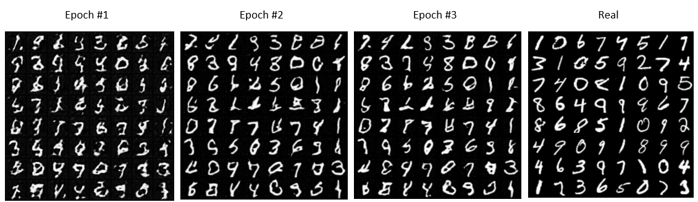

## Deep Convolution Generative Adversarial Networks

[Paper](https://arxiv.org/abs/1511.06434) | Official [Implementation](https://github.com/pytorch/examples/tree/master/dcgan)

**Train:**
* Modify `config.py` file to specify `dataset, batch_size, img_size, ...`
* Run `python main.py`

 

**Result:**

After every 100 training iterations, the files `real_samples.png` and `fake_samples.png` are written to disk with the samples from the generative model.

After every epoch, models are saved to: `netG_epoch_%d.pth` and `netD_epoch_%d.pth`